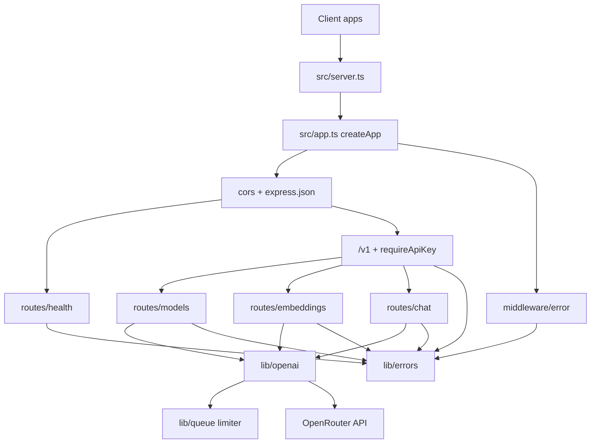

<!-- generated-by: gsd-doc-writer -->
# Architecture

## System overview

**openrouter-gateway** is a single-process Express HTTP proxy that sits between client applications and [OpenRouter](https://openrouter.ai). Clients call OpenAI-compatible REST endpoints on this service; the gateway holds `OPENROUTER_API_KEY`, optionally authenticates callers with `API_KEY`, validates request bodies, caps concurrent upstream calls, and forwards chat completions (including SSE streaming), embeddings, and model listing to OpenRouter’s OpenAI-compatible API. The architectural style is a layered monolith: process entry → Express app composition → middleware → route handlers → shared OpenRouter client helpers.

## Component diagram



## Data flow

Typical authenticated non-streaming request:

1. `src/server.ts` binds `createApp()` on `PORT` (default `3000`) at `0.0.0.0`.
2. Request hits global middleware in `src/app.ts`: CORS (`origin: *`, methods `GET`/`POST`/`OPTIONS`, headers `Content-Type` / `Authorization` / `X-API-Key`) and `express.json` with a **10 MB** body limit.
3. Paths under `/v1` run `requireApiKey` (`src/middleware/auth.ts`): if `API_KEY` is unset, the request proceeds; otherwise `Authorization: Bearer …` or `X-API-Key` must match.
4. The matching router validates input (Zod in chat/embeddings; models has no body) and calls `runOpenAI` / `runOpenAIHeld` from `lib/openai.ts`.
5. Those helpers acquire a slot from the in-process FIFO limiter (`lib/queue.ts`, concurrency **5**), build an OpenAI SDK client pointed at `https://openrouter.ai/api/v1`, and invoke the upstream method.
6. Success: JSON response (or SSE chunks for `stream: true` on chat). Failure: route maps SDK errors via `mapOpenAIError`, or the central `errorHandler` serializes `{ message, code, status }` via `sendApiError`.

`GET /health` skips the `/v1` auth router and returns `{ status: "ok" }` without calling OpenRouter.

Streaming chat additionally holds the concurrency slot until the SSE stream finishes or the client disconnects (`runOpenAIHeld`), aborts the upstream stream on disconnect, and writes OpenAI-compatible `data: …` / `data: [DONE]` events with a **120 s** create timeout.

## Key abstractions

| Abstraction | Location | Role |
|-------------|----------|------|
| `createApp` | `src/app.ts` | Composes Express middleware, mounts routers, 404 → `ApiError`, registers `errorHandler`. |
| `requireApiKey` | `src/middleware/auth.ts` | Optional gateway auth for all `/v1/*` routes. |
| `asyncHandler` | `src/middleware/error.ts` | Wraps async route handlers so rejections reach Express error middleware. |
| `errorHandler` | `src/middleware/error.ts` | Maps `ApiError`, oversized body, and invalid JSON to the standard error envelope. |
| `ApiError` (class) | `lib/errors.ts` | Typed HTTP error with `status`, `code`, and `message`. |
| `sendApiError` / `mapOpenAIError` | `lib/errors.ts` | Uniform JSON errors; maps OpenAI SDK rate-limit / timeout / bad-request to gateway codes. |
| `ApiError` (interface) | `lib/types.ts` | Response body shape `{ message, code, status }`. |
| `getOpenAIClient` | `lib/openai.ts` | Builds OpenAI SDK client for OpenRouter (`OPENROUTER_API_KEY`, optional Referer/Title headers, 30 s timeout). |
| `runOpenAI` / `runOpenAIHeld` | `lib/openai.ts` | Run upstream work under the shared concurrency pool (held slot for streaming). |
| `createLimiter` / `Limiter` | `lib/queue.ts` | In-process FIFO semaphore; waiters are never dropped. |

Route modules (`healthRouter`, `modelsRouter`, `embeddingsRouter`, `chatRouter`) are Express `Router` instances mounted in `createApp`.

## Directory structure rationale

```
ai-app/
├── src/                 # Express application entry, composition, middleware, and HTTP routes
│   ├── server.ts        # Process bootstrap: createApp + listen
│   ├── app.ts           # App factory and route mounting
│   ├── middleware/      # Cross-cutting HTTP concerns (auth, errors)
│   └── routes/          # One router per API surface area
├── lib/                 # Framework-agnostic shared helpers used by routes (client, queue, errors)
├── docs/                # Project documentation
├── package.json         # Scripts: dev/start via tsx on src/server.ts
└── vitest.config.ts     # Tests under src/**/*.test.ts and lib/**/*.test.ts
```

- **`src/`** owns the HTTP boundary so routing and Express middleware stay together and easy to test with Supertest.
- **`lib/`** holds OpenRouter client construction, concurrency limiting, and error mapping so route files stay thin validation + proxy glue.
- There is no separate service or repository layer: each route talks to OpenRouter through `lib/openai` and returns the upstream payload (or mapped errors) directly.
