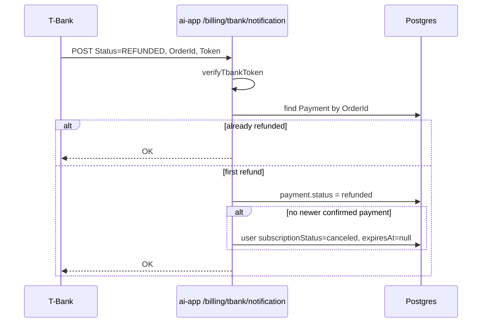

# Full Payment Refund → Deactivate License

**Date:** 2026-08-04  
**Status:** Approved — plan ready  
**Repo:** `ai-app` (gateway)  
**Approach:** A — full refund immediately revokes annual license

## Goal

When T-Bank reports a **full refund** (`REFUNDED`) for a payment that previously activated a year license, the gateway must mark the payment as `refunded` and deactivate the user’s subscription so paid access stops immediately. Money and access stay aligned.

## Non-goals

- Partial refunds (`PARTIAL_REFUNDED`) — ignore for license state; optional log only
- Calling T-Bank `Cancel` from the app (refund stays merchant/dashboard or support)
- Client UI copy for “license revoked after refund”
- Admin panel / manual revoke tooling
- Changing guest quota rules

## Product rules

| T-Bank `Status` | Our `Payment.status` | Subscription |
|-----------------|----------------------|--------------|
| `CONFIRMED` | `confirmed` + `activateYearLicense` (existing) | `active` + `expiresAt` |
| `REJECTED` / `CANCELED` / `DEADLINE_EXPIRED` while payment `pending` | `rejected` (existing) | unchanged |
| `REFUNDED` | `refunded` | deactivate if this payment still “owns” access (see below) |
| `PARTIAL_REFUNDED` | unchanged | unchanged |
| `CANCELED` on already `confirmed` | unchanged | unchanged — full post-capture return is `REFUNDED` |

**Deactivate fields:** `subscriptionStatus = canceled`, `subscriptionExpiresAt = null`.

**Idempotency:** repeat `REFUNDED` on already `refunded` payment → HTTP `200` `OK`, no-op.

**Ownership rule (MVP):** after marking refund, deactivate only if the user has **no newer** payment with status `confirmed`. If they bought again after this payment, keep the newer license.

## Architecture

Fallback: `POST /billing/sync` (authenticated) should apply the same `REFUNDED` handling when `GetState` returns `REFUNDED` and the payment is not yet `refunded` (webhook miss).

## Code changes

### `src/lib/subscription.ts`

Add `deactivateLicense(prisma, userId)`:

- sets `subscriptionStatus: 'canceled'`
- sets `subscriptionExpiresAt: null`

`hasActiveSubscription` already requires `active` + future `expiresAt`, so `canceled` yields no paid access without further changes.

### `src/routes/billing.ts`

1. In `/tbank/notification`, handle `status === 'REFUNDED'` before/alongside existing reject branch:
   - resolve payment (existing lookup)
   - if `payment.status === 'refunded'` → `OK`
   - else update to `refunded`
   - query newest `confirmed` payment for `userId`; if none (or only older than this one) → `deactivateLicense`
2. Keep pending fail statuses (`REJECTED` / `CANCELED` / `DEADLINE_EXPIRED`) as today — only while `pending` → `rejected`
3. In `/billing/sync`, when `getPaymentState` returns `REFUNDED`, mirror notification refund logic (do not only handle `CONFIRMED`)

No Prisma schema migration: `PaymentStatus.refunded` and `SubscriptionStatus.canceled` already exist.

## Testing

- `deactivateLicense` unit: status `canceled`, `expiresAt` null
- Notification `REFUNDED` on `confirmed` payment → payment `refunded` + user deactivated
- Second `REFUNDED` → no double-update errors, still `OK`
- `PARTIAL_REFUNDED` → payment/subscription unchanged
- `pending` + `CANCELED` → `rejected`, no deactivate
- User with newer `confirmed` payment → refund of older payment does not deactivate
- Sync path: `GetState` `REFUNDED` applies same outcome

## Env / ops

No new env vars. Demo/test flow: pay with test card → Cancel in T-Bank «Операции» or API → expect webhook `REFUNDED` → license off; verify via `GET /billing/status`.
