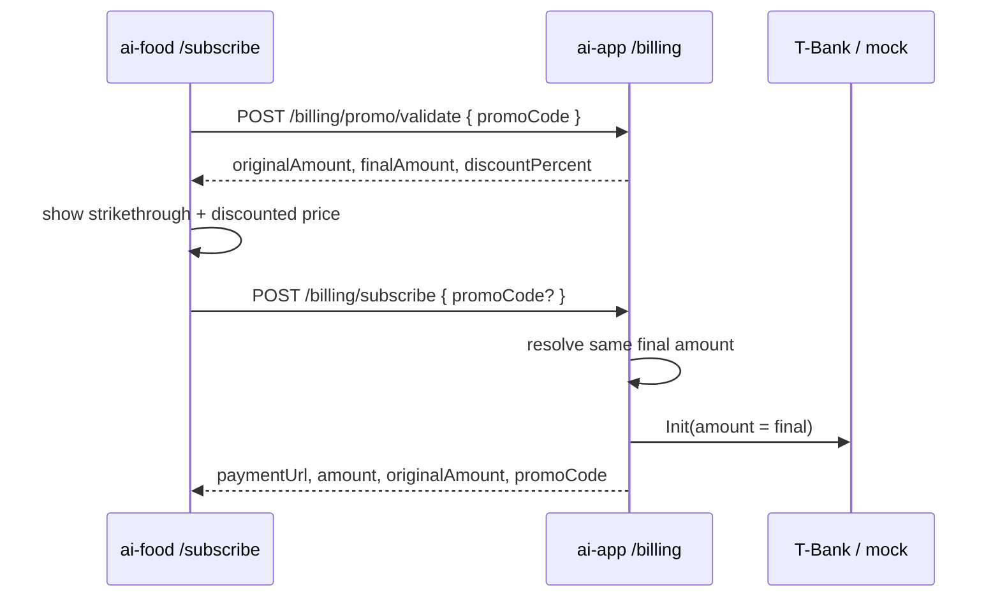

# Promo Codes on Subscribe

**Date:** 2026-08-04  
**Status:** Approved — implemented  
**Repos:** `ai-app` (gateway) + `ai-food` (subscribe UI)  
**Approach:** A — hardcoded catalog on gateway; validate endpoint + discounted subscribe

## Goal

Let users enter a promo code on `/subscribe`, preview the discounted price, and pay the reduced amount through the existing T-Bank / mock flow. Catalog lives in gateway code (no DB).

## Non-goals

- Persisting promo usage or catalog in Postgres / Prisma
- Per-user or global redemption limits
- Admin UI for managing codes
- Fixed-amount (ruble) discounts — percent only
- Changing license duration or guest quota rules

## Product rules

| Code (case-insensitive) | Discount |
|-------------------------|----------|
| `new80` | 80% |
| `new50` | 50% |

- **No usage limits** — any authenticated user may apply a valid code on every new payment.
- Normalize: `trim` + lowercase before lookup.
- Empty / unknown code → reject (`INVALID_PROMO`); do not create a payment.
- Missing `promoCode` on subscribe → full list price (unchanged behavior).

**Price formula (kopecks):**

```
original = getSubscriptionPriceKopecks()
final = max(1, floor(original * (100 - discountPercent) / 100))
```

Minimum **1** kopeck so T-Bank Init never receives `0`.

## Architecture



Source of truth for discounts is **only** the gateway catalog. Client never computes the paid amount.

## API

### `POST /billing/promo/validate`

- Auth: `X-User-Token`
- Body: `{ "promoCode": string }`
- Success `200`:

```json
{
  "valid": true,
  "code": "new80",
  "discountPercent": 80,
  "originalAmount": 10000,
  "finalAmount": 2000
}
```

- Failure: `400 INVALID_PROMO` (empty, whitespace-only, or unknown after normalize)

### `POST /billing/subscribe` (extend)

- Body may include optional `promoCode`.
- On valid promo: `Payment.amount = finalAmount`; Init/mock uses that amount.
- On invalid promo: `400 INVALID_PROMO`, no `Payment` row.
- Response adds: `amount`, `originalAmount`, `promoCode` (`null` if none). Existing `paymentUrl` / `paymentId` unchanged.

No Prisma migration: do not store promo on `Payment`.

## Code map

| Area | Change |
|------|--------|
| `apps/ai-app/src/lib/promos.ts` | Catalog + `resolvePromo(code)` / amount helper |
| `apps/ai-app/src/routes/billing.ts` | `POST /promo/validate`; subscribe reads `promoCode` |
| `apps/ai-app` tests | Unit + route cases below |
| `apps/ai-food` billing API | `validatePromo`, `subscribe(promoCode?)` |
| `apps/ai-food` `SubscribePage` | Input + Apply + price preview |

## UI (`/subscribe`)

- Under the price block: text field «Промокод» + button «Применить».
- Before apply: show full price (current copy; after apply use amounts from validate).
- After successful apply: strikethrough original, show `finalAmount`, indicate percent off; keep applied code in state.
- Invalid code: error toast / field error; clear applied discount.
- If the user edits the field after a successful apply, clear applied state until they Apply again.
- «Оплатить» sends `promoCode` only when apply succeeded for the current field value.
- Unauthenticated: same as pay today — validate/subscribe need login (redirect / existing copy).

## Testing

- `new80` / `new50` → correct `finalAmount` for default and custom `SUBSCRIPTION_PRICE_KOPECKS`
- ` New80 ` normalizes and succeeds
- Unknown / empty → `INVALID_PROMO`
- Subscribe with promo → `Payment.amount` equals discounted amount
- Subscribe without promo → full price
- Subscribe with bad promo → 400, no payment created

## Env / ops

No new env vars. Codes change by editing `promos.ts` and redeploying gateway.
