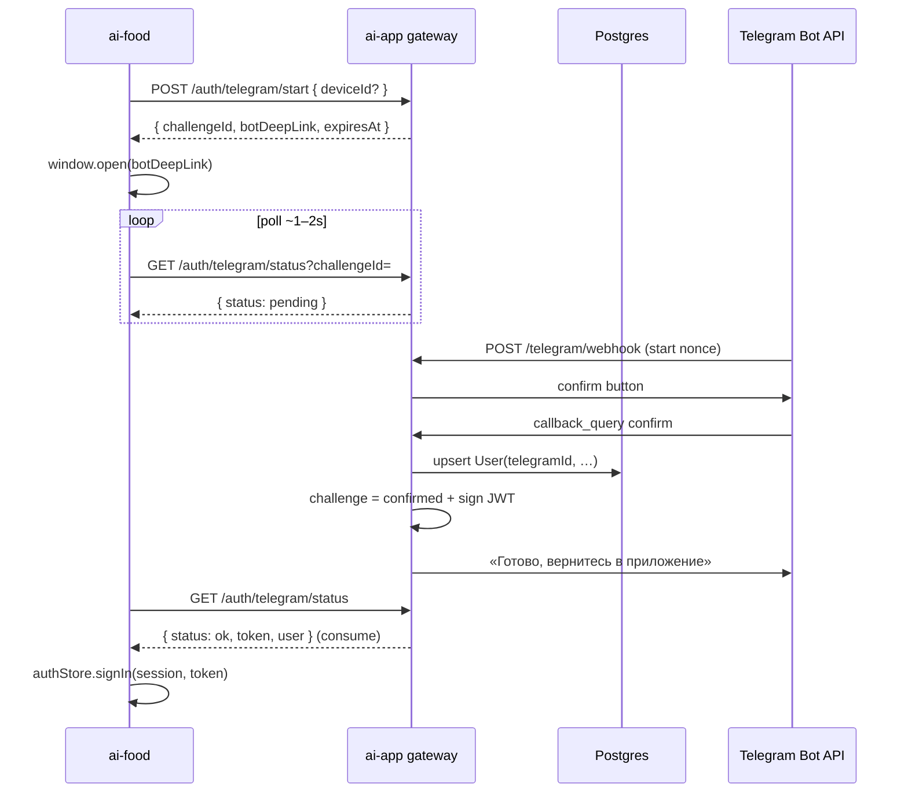

# Telegram Bot Auth (replace Flash-Call)

**Date:** 2026-08-04  
**Status:** Approved (conversation) — awaiting spec file review  
**Repos:** `ai-app` (gateway) primary; `ai-food` login UX  
**Approach:** Bot inside `ai-app` (same Express process), webhook + login challenge poll — not a separate bot service

## Goal

Replace Flash-Call phone auth with **Telegram bot login**:

1. User on `/login` starts a challenge and opens `t.me/<bot>?start=<nonce>`.
2. Bot asks to confirm; on confirm, gateway upserts `User` by `telegramId` and marks challenge ready with JWT.
3. Web app polls status and receives `{ token, user }` once.

Flash-Call is removed entirely. Guest quota + subscription rules stay as today (login ≠ unlimited; unlimited only with active subscription).

## Non-goals

- Separate `apps/telegram-bot` service
- Telegram Login Widget (official embed) — replaced by bot deep-link flow
- Telegram Mini App / WebApp auth
- Bot commands beyond login (`/start` + confirm callback)
- Notifications, menus, or product surface in the bot
- Keeping phone/`FLASHCALL_*` as fallback
- Multi-device identity merge beyond existing `deviceId` link-on-login

## Architecture



Placement: all bot + auth code lives in `apps/ai-app`. No second deploy unit.

Webhook (not long-polling) in production. On server boot (when `TELEGRAM_BOT_TOKEN` + public gateway URL configured): `setWebhook`. Local/dev: document ngrok or optional polling behind a flag — not required for MVP if webhook URL available.

## Data model

Revert identity from phone to Telegram profile fields:

```prisma
model User {
  id                    String             @id @default(cuid())
  telegramId            String             @unique
  username              String?
  firstName             String?
  lastName              String?
  photoUrl              String?
  subscriptionStatus    SubscriptionStatus @default(none)
  subscriptionExpiresAt DateTime?
  createdAt             DateTime           @default(now())
  updatedAt             DateTime           @updatedAt
  devices               Device[]
  usageEvents           UsageEvent[]
  payments              Payment[]
}
```

**Migration:** destructive for MVP — drop Flash-Call-era phone users/payments (same stance as prior phone migration). No phone→telegram mapping.

**JWT** (`AUTH_SECRET`): `{ sub: userId, telegramId }` (replace `phone` claim).

**Login challenge** (in-memory store, same pattern as former `flashcallChallenge`):

| Field | Notes |
|-------|--------|
| `id` | UUID — returned to client as `challengeId` |
| `nonce` | opaque token in `?start=` (URL-safe, unguessable) |
| `status` | `pending` \| `confirmed` \| `consumed` \| `expired` |
| `deviceId` | optional, from start |
| `userId` / `token` | set on confirm |
| `expiresAt` | ~5 minutes from create |

Rules:

- Confirm only if `pending` and not expired.
- Successful status poll **consumes** challenge (one-shot JWT delivery).
- Replay poll after consume → `expired` / not found, never re-issue same token via this endpoint.

## HTTP API

| Method | Path | Auth | Body / query | Response |
|--------|------|------|--------------|----------|
| `POST` | `/auth/telegram/start` | none* | `{ deviceId?: string }` | `{ challengeId, botDeepLink, expiresAt }` |
| `GET` | `/auth/telegram/status` | none* | `challengeId` | see below |
| `GET` | `/auth/me` | `X-User-Token` | — | user + subscription public fields |
| `POST` | `/telegram/webhook` | webhook secret | Telegram Update JSON | `200` quickly |

\* Gateway `API_KEY` does **not** gate `/auth/*` or webhook (same as current flashcall auth routes).

### Status responses

Always HTTP **200** (poll loop stays simple):

- Pending: `{ status: "pending" }`
- Expired / unknown / consumed: `{ status: "expired" }`
- Ready (first successful poll): `{ status: "ok", token, user }` where `user` includes `id`, `telegramId`, profile fields, `hasActiveSubscription` / `subscriptionExpiresAt`

### Delete

- Routes: `/auth/flashcall/start`, `/auth/flashcall/verify`
- Libs: `flashcall.ts`, `flashcallChallenge.ts`, `phone.ts` (+ tests)
- Env: `FLASHCALL_API_KEY`

## Bot behavior

1. `/start <nonce>`  
   - Valid pending challenge → message + inline button «Подтвердить вход в AI Food» (`callback_data` binds challenge/nonce).  
   - Missing/expired → «Ссылка устарела. Начните вход на сайте.»
2. Callback confirm → upsert user from Telegram `from` (+ photo if present), attach `deviceId` if any, sign JWT onto challenge, answer callback, edit/send success text.
3. Any other text → short «Этот бот только для входа в AI Food.»

Webhook security: fixed path `POST /telegram/webhook`; verify Telegram header `X-Telegram-Bot-Api-Secret-Token` against `TELEGRAM_WEBHOOK_SECRET` (set via `setWebhook.secret_token`). Missing/mismatch → `401`. Required whenever webhook is enabled.

Library: thin `fetch` to Bot API only (no grammY). Methods: `sendMessage`, `answerCallbackQuery`, `editMessageText` (optional), `setWebhook`, `deleteWebhook`.

## Frontend (`ai-food`)

- Replace `TelegramLoginButton` (Login Widget) with bot-login flow: start → open deep link → poll → `useAuthStore.signIn`.
- Keep `VITE_AUTH_MOCK` demo path.
- `VITE_TELEGRAM_BOT_USERNAME` optional for copy; **canonical** bot username for deep links comes from gateway (`botDeepLink`).
- Update copy on `/login` (no widget domain requirement).
- Remove client calls to `/auth/telegram` widget payload exchange; wire to `/auth/telegram/start` + `/status`.

## Env

**`apps/ai-app/.env`**

| Var | Role |
|-----|------|
| `TELEGRAM_BOT_TOKEN` | BotFather token (accept `AUTH_TELEGRAM_BOT_TOKEN` alias if already present) |
| `TELEGRAM_BOT_USERNAME` | Without `@` — build deep links |
| `TELEGRAM_WEBHOOK_SECRET` | Value for `setWebhook.secret_token` / header check |
| `PUBLIC_GATEWAY_URL` | Public origin of **gateway** (e.g. `https://api.example.com`) for `setWebhook`; distinct from frontend `PUBLIC_APP_URL` |
| `AUTH_SECRET`, `DATABASE_URL` | unchanged |

If `PUBLIC_GATEWAY_URL` is unset, skip auto-`setWebhook` at boot (manual webhook ok for ops).

Remove `FLASHCALL_API_KEY` from examples and Dokploy docs.

**`apps/ai-food/.env`**

- Keep `VITE_AI_GATEWAY_*`, `VITE_AUTH_MOCK`
- `VITE_TELEGRAM_BOT_USERNAME` optional UX only
- Drop Login Widget domain comments as authoritative auth path

## Errors

| Case | Behavior |
|------|----------|
| Missing bot token / username | `503` on start; webhook disabled |
| Invalid/expired nonce on bot | Soft message in chat, no JWT |
| Poll after consume / unknown id | `status: "expired"` |
| Webhook secret mismatch | `401` |
| DB down | `503 DATABASE_UNAVAILABLE` (existing pattern) |

## Tests

- Challenge lifecycle: create → confirm → consume → second poll expired
- Webhook: confirm upserts user, wrong secret rejected
- Route tests replacing `auth.flashcall.test.ts`
- JWT round-trip with `telegramId`
- Frontend: start+poll happy path (unit/mock fetch) — optional if time-boxed

## Docs to update

- `apps/ai-food/docs/AI-GATEWAY.md` — endpoints, env (remove flashcall / fix stale widget docs)
- `docs/DOKPLOY.md` — env list, webhook URL note
- `.env.example` in both apps

## Out of scope follow-ups

- Persist challenges in Redis/Postgres if multi-instance gateway is required
- Long-polling dev mode polish
- Linking old phone users (none kept)
