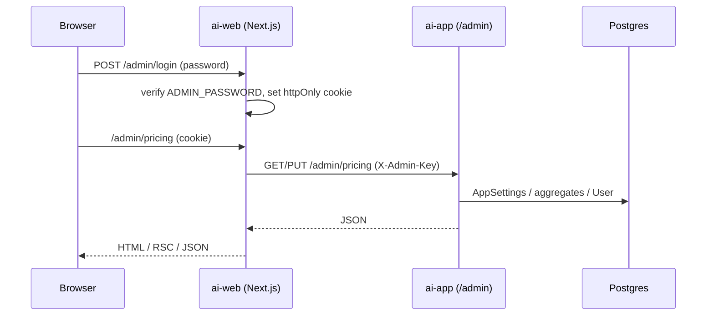

# Admin Web (Next.js) + Gateway Admin API

**Date:** 2026-08-04  
**Status:** Approved  
**Repos:** `apps/ai-web` (new Next.js app) + `apps/ai-app` (admin API, AppSettings)  
**Approach:** Next.js UI (Ant Design) + `/admin/*` on gateway; password gate on UI; API key for server→gateway

## Goal

Отдельный веб-фронт для админки продукта: менять цену/длительность лицензии, смотреть базовую статистику, искать пользователей и вручную управлять подписками. Публичный корень `/` — заглушка под будущий лендинг для трафика. Админка на `/admin`.

## Non-goals

- Capacitor / нативная оболочка
- Полноценный маркетинговый лендинг (только заглушка)
- UI управления промокодами
- Refund через T-Bank / смена статусов Payment из админки
- Мульти-админы, роли, SSO
- Изменение guest-квот из админки
- Прямой доступ браузера к Postgres

## Decisions

| Вопрос | Решение |
|--------|---------|
| MVP scope | Цены + статистика + подписки (activate / extend / revoke) |
| Цена | Runtime в БД (`AppSettings`); env — fallback |
| Публичная часть | Минимальная заглушка на `/` |
| Подписки | Поиск + activate / extend N days / revoke |
| Архитектура | Next.js UI + admin API в `ai-app` |
| UI kit | Ant Design (не shadcn из ai-food) |
| Стек UI | Next.js App Router, React 18, TypeScript, TanStack Query, Ant Design |

## Architecture



### Package layout

- **`apps/ai-web`** — Next.js App Router, package name e.g. `ai-web`
  - `/` — лендинг-заглушка
  - `/admin/login` — пароль
  - `/admin` — обзор статистики
  - `/admin/pricing` — цена и длительность
  - `/admin/subscriptions` — поиск и действия по подписке
- **`apps/ai-app`** — Express routes `/admin/*`, Prisma `AppSettings`, async price/duration helpers
- Root turbo/pnpm: scripts `dev:web`, `build:web` (по аналогии с food/app)

### Auth

**UI (`ai-web`):**

| Env | Назначение |
|-----|------------|
| `ADMIN_PASSWORD` | Пароль формы логина (сгенерировать при реализации) |
| `ADMIN_SESSION_SECRET` | Подпись httpOnly session cookie (~7 дней) |
| `ADMIN_API_KEY` | Server-only; уходит на gateway |
| `AI_GATEWAY_URL` | Base URL gateway (например `http://localhost:3000`) |

- Логин: Route Handler, timing-safe compare с `ADMIN_PASSWORD`
- Middleware: все `/admin/*` кроме `/admin/login` требуют валидную cookie → иначе redirect на login
- Logout: очистка cookie
- Браузер **никогда** не получает `ADMIN_API_KEY`

**Gateway (`ai-app`):**

| Env | Назначение |
|-----|------------|
| `ADMIN_API_KEY` | Тот же ключ, что в ai-web (server) |

- Middleware на `/admin/*`: заголовок `X-Admin-Key` должен совпадать; иначе `401 UNAUTHORIZED`
- Если `ADMIN_API_KEY` не задан — admin routes отклоняют все запросы (fail-closed)

В репозиторий коммитятся только `.env.example` без реальных секретов. Локальные `.env` генерируются при реализации.

## Data model

```prisma
model AppSettings {
  id                       Int      @id @default(1) // singleton row
  subscriptionPriceKopecks Int?
  subscriptionDurationDays Int?
  updatedAt                DateTime @updatedAt
}
```

- `null` в поле = не переопределено → fallback на env → hard default (цена `10000` коп., длительность `365` дней)
- `getSubscriptionPriceKopecks` / `getSubscriptionDurationDays` становятся **async** (чтение БД + fallback); все callers в billing (включая promo/subscribe) переводятся на `await`
- Публичный `GET /billing/price` и Init оплаты сразу видят цену из админки без рестарта процесса

## Admin API (`ai-app`)

Общий префикс `/admin`, auth: `X-Admin-Key`. Ошибки — существующий envelope `{ message, code, status }`.

| Method | Path | Body / query | Success |
|--------|------|--------------|---------|
| `GET` | `/admin/stats` | — | Сводка (ниже) |
| `GET` | `/admin/pricing` | — | `{ priceKopecks, durationDays, source: "db" \| "env" }` |
| `PUT` | `/admin/pricing` | `{ priceKopecks?: number, durationDays?: number }` | То же после upsert |
| `GET` | `/admin/users?q=` | `q` — telegramId / username / id | `{ users: [...] }` лимит 20 |
| `POST` | `/admin/users/:id/subscription` | `{ action, days? }` | Обновлённый user snapshot |

### `GET /admin/stats`

```json
{
  "usersTotal": 0,
  "activeSubscriptions": 0,
  "paymentsConfirmedCount": 0,
  "paymentsConfirmedSumKopecks": 0,
  "usageAnalyzeLast7Days": 0,
  "usageRefineLast7Days": 0,
  "usageAnalyzeLast30Days": 0,
  "usageRefineLast30Days": 0
}
```

`activeSubscriptions` — users с `subscriptionStatus === active` и `subscriptionExpiresAt > now`.

### Subscription actions

| `action` | Поведение |
|----------|-----------|
| `activate` | `status = active`, `expiresAt = now + days` (`days` default = текущая duration из settings/env) |
| `extend` | `status = active`, `expiresAt = max(now, currentExpires) + days` (`days` обязателен, > 0) |
| `revoke` | `status = none`, `expiresAt = null` |

Неизвестный user → `404 NOT_FOUND`. Невалидный body → `400 VALIDATION_ERROR`.

## UI screens (`ai-web`, Ant Design)

- **Login** — `Card` + `Form` + `Input.Password`
- **Shell** — `Layout` (Sider: Обзор / Цены / Подписки; Header: Выйти)
- **Обзор** — `Statistic` cards из `/admin/stats`
- **Цены** — форма ₽ + дни; API в копейках; показать `source`
- **Подписки** — `Input.Search` → список → activate / extend (Modal с N дней) / revoke (Popconfirm)
- **`/`** — простая заглушка без admin chrome: название продукта + «Скоро»

Данные за паролем: server-side fetch к gateway (Route Handlers / Server Actions) + клиентский TanStack Query где уместно для таблиц/форм.

## Error handling

- Gateway: стандартный JSON envelope
- UI: Ant Design `message` / `notification` на 4xx/5xx и сетевые сбои
- Неверный пароль логина → понятная ошибка формы, без утечки существования конфига

## Testing

- **ai-app:** admin key middleware (401 без ключа); pricing get/put + env fallback; subscription activate/extend/revoke; stats response shape
- **ai-web:** `type-check`; smoke login route (optional unit)
- Ручная проверка: смена цены → `GET /billing/price` отражает новое значение без рестарта

## Rollout / local dev

```bash
pnpm --filter ai-web dev   # или turbo filter
pnpm --filter openrouter-gateway dev
```

После миграции Prisma `AppSettings` — одна строка создаётся при первом `PUT /admin/pricing` (upsert id=1).

## Open follow-ups (не в этом MVP)

- Полноценный лендинг на `/`
- Promo catalog в админке
- Audit log действий админа
