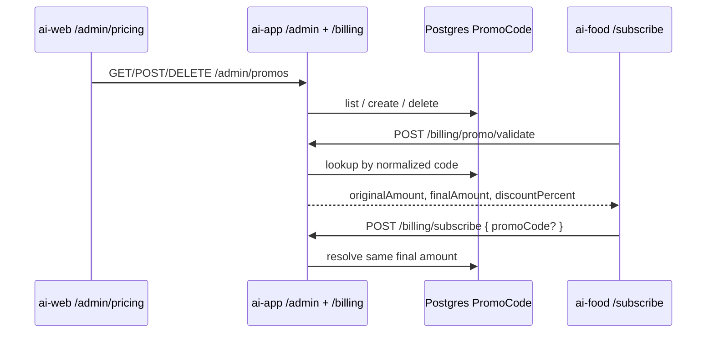

# Admin-managed Promo Codes

**Date:** 2026-08-05  
**Status:** Approved  
**Repos:** `ai-app` (gateway + Prisma) + `ai-web` (admin pricing page)  
**Approach:** A — `PromoCode` table in Postgres; create/delete via admin API; section on «Цены»

## Goal

Replace the hardcoded promo catalog (`new80` / `new50` in `promos.ts`) with DB-backed codes that admins can create and delete on the admin pricing page. Billing validate/subscribe continue to resolve discounts from the gateway only.

## Non-goals

- Editing an existing promo (delete + recreate)
- Expiry dates or redemption limits (global or per-user)
- Fixed-amount (ruble) discounts — percent only
- Separate sidebar nav item «Промокоды»
- Storing promo code on `Payment`
- Changes to `ai-food` SubscribePage UX or public API shapes
- Seeding / migrating the old hardcoded `new80` / `new50` into the DB

## Product rules

| Rule | Detail |
|------|--------|
| Fields | `code` + `discountPercent` (integer 1–99) |
| Normalize | `trim` + lowercase on create and on lookup |
| Uniqueness | Normalized `code` is unique; duplicate create → 409 |
| Catalog after migrate | Empty — no seed of former hardcoded codes |
| Missing / unknown code | `400 INVALID_PROMO` on validate/subscribe (unchanged) |
| Missing `promoCode` on subscribe | Full list price (unchanged) |
| Price formula | `final = max(1, floor(original * (100 - percent) / 100))` kopecks |

## Architecture



Source of truth for discounts is the `PromoCode` table. Client never computes the paid amount.

## Data model

Prisma model `PromoCode`:

| Field | Type | Notes |
|-------|------|-------|
| `id` | `String` `@id @default(cuid())` | |
| `code` | `String` `@unique` | Stored normalized |
| `discountPercent` | `Int` | 1–99 validated in API |
| `createdAt` | `DateTime` `@default(now())` | |
| `updatedAt` | `DateTime` `@updatedAt` | |

Migration: add table only. No seed. Remove in-memory `Map` from `promos.ts`; `lookupPromo` becomes async DB read (or sync helper over a fetched row).

Without `DATABASE_URL` / Prisma: admin promo CRUD → `503 DATABASE_UNAVAILABLE`; billing with a promo code → `INVALID_PROMO` (no hardcoded fallback).

## Admin API

Auth: existing `requireAdminKey` (same as pricing).

### `GET /admin/promos`

Success `200`:

```json
{
  "items": [
    {
      "id": "clx…",
      "code": "summer20",
      "discountPercent": 20,
      "createdAt": "2026-08-05T10:00:00.000Z"
    }
  ]
}
```

### `POST /admin/promos`

Body: `{ "code": string, "discountPercent": number }`

- Normalize code; reject empty → `400 VALIDATION_ERROR`
- `discountPercent` must be integer 1–99 → else `400`
- Duplicate unique code → `409 CONFLICT`
- Success `201`: created item (same shape as list item)

### `DELETE /admin/promos/:id`

- Missing id → `404`
- Success `200`: `{ "ok": true }` (same pattern as `DELETE /admin/payments/:id`)

## Billing (unchanged contract)

- `POST /billing/promo/validate` and `POST /billing/subscribe` keep current request/response shapes.
- Implementation: resolve via DB `PromoCode` instead of hardcoded map.
- Deleted codes stop working immediately on next validate/subscribe.

## Admin UI (`ai-web` `/admin/pricing`)

Below the existing pricing card, a second card **«Промокоды»**:

- Form: code input + discount % (`InputNumber` 1–99) + «Создать»
- Table: code | discount % | «Удалить» with confirm
- Empty state: «Промокодов пока нет»
- Errors via Ant Design `message.error` (duplicate, validation, network)
- Proxy through existing admin gateway routes pattern (`/api/admin/gateway/…`)

No sidebar changes. No `ai-food` UI changes.

## Testing

- `lookupPromo` / `resolvePromo` with DB row present / absent / normalized case
- Admin: list empty; create; duplicate 409; delete; delete missing 404
- Billing: validate/subscribe succeed for DB code; fail for removed/unknown; subscribe without promo = full price
- Admin CRUD without DB → 503

## Code map

| Area | Change |
|------|--------|
| `apps/ai-app/prisma/schema.prisma` | Add `PromoCode` + migration |
| `apps/ai-app/src/lib/promos.ts` | Remove hardcoded map; DB lookup |
| `apps/ai-app/src/routes/admin.ts` | GET/POST/DELETE promos |
| `apps/ai-app` tests | Unit + admin + billing cases |
| `apps/ai-web` gateway proxy | Routes for promos |
| `apps/ai-web/.../admin/pricing/page.tsx` | Promos section UI |
| `apps/ai-web` adminApi / types | As needed for CRUD |

## Env / ops

No new env vars. Codes change via admin UI without gateway redeploy (after migration applied).
