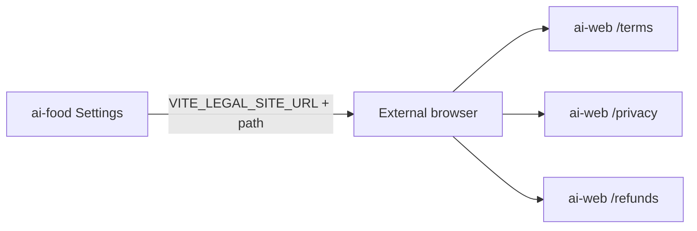

# Legal site pages (ai-web) + deep links from ai-food

**Date:** 2026-08-05  
**Status:** Approved  
**Repos:** `apps/ai-web` (public legal pages), `apps/ai-food` (Settings links + remove in-app legal)  
**Approach:** Next.js App Router pages on `ai-web`; CalZen-like structure; Russian copy with AI Food / ИП data; open from app via `VITE_LEGAL_SITE_URL`

**Supersedes (partially):** in-app hosting of Условия/Приватность from `apps/ai-food/docs/superpowers/specs/2026-08-04-legal-documents-design.md`. Price API (`GET /billing/price`) and subscribe UI remain unchanged.

## Goal

Опубликовать на публичном сайте (`ai-web`) три юридические страницы по образцу CalZen ([terms](https://calzen.ai/terms.html), [privacy](https://calzen.ai/privacy.html), [refunds](https://calzen.ai/refunds.html)): структура разделов как у референса, тексты на русском, реквизиты и факты сервиса AI Food. Из приложения при нажатии «Условия» / «Приватность» / «Возврат» открывать соответствующий URL сайта. Базовый адрес сайта — из env (заполняет владелец).

## Non-goals

- Полноценный маркетинговый лендинг (корень `/` остаётся заглушкой «Скоро»)
- Cookie-banner, GDPR/CCPA таблицы «как у CalZen» дословно (адаптируем под РФ / ИП / 152‑ФЗ)
- Юридическая экспертиза / подача уведомлений в Роскомнадзор
- Общий npm-пакет контента между `ai-food` и `ai-web`
- In-app fallback страницы legal (env обязателен для ссылок; без URL кнопки не ведут на старые роуты)
- Изменение payment / billing API

## Decisions

| Вопрос | Решение |
|--------|---------|
| Источник структуры | CalZen terms / privacy / refunds |
| Язык | Русский |
| Данные продавца | Из текущего `legalConfig` ai-food (ИП, ИНН, ОГРНИП, email, Telegram, productName) |
| Где хостятся документы | Только `ai-web` |
| In-app `/legal/*` | Удалить полностью |
| Как открывать из app | Внешний браузер: `target="_blank"` + `rel="noopener noreferrer"` |
| Env | `VITE_LEGAL_SITE_URL` в `ai-food` (база без trailing slash) |
| Пути | `/terms`, `/privacy`, `/refunds` (без `.html`) |
| Кнопка «Возврат» | Добавить в Settings → «О приложении» |
| UI kit на legal pages | Простой CSS / существующий `globals.css` ai-web; не Ant Design admin chrome |
| Middleware | Не расширять matcher: `/admin/*` only — legal публичны |

## Architecture



### `apps/ai-web`

**Routes (App Router):**

| Path | Title |
|------|--------|
| `/terms` | Условия использования |
| `/privacy` | Политика конфиденциальности |
| `/refunds` | Политика возврата |

**Shared UI:**

- `LegalDocumentLayout` — шапка со ссылкой «← На главную», `h1`, дата «Обновлено: …», `children` (секции), футер с перекрёстными ссылками Terms / Privacy / Refunds + © + блок ИП.
- Контент — TS-модули с секциями `{ title, paragraphs: string[] }` (аналог `LegalSection` из food), без зависимости от ai-food.

**Config:** `src/lib/legalConfig.ts` — копия актуальных реквизитов (единственный runtime-источник после удаления из food):

- `revisionDate`, `sellerName`, `inn`, `ogrnip`, `email`, `productName`, `telegramSupport`, `telegramLabel`

**Content modules (outline — структура CalZen, факты AI Food):**

1. **Terms** — принятие условий; регистрация/аккаунт (Telegram); ссылка на Privacy; права на ПО; подписка/лицензия (разовая оплата T‑Bank, без автопродления iTunes — адаптировать под нашу модель); изменение условий; прекращение доступа; дисклеймер «не медуслуга»; контакты.
2. **Privacy** — оператор (ИП); данные, которые предоставляет пользователь; автоматические/технические; платежи (T‑Bank, без PAN); цели; правовые основания (152‑ФЗ / договор); AI-обработка (фото/текст → gateway / OpenRouter); передача третьим лицам; трансграничная передача; сроки и защита; права субъекта; дети; изменения; контакты.
3. **Refunds** — цифровая услуга с немедленным доступом; когда возврат возможен; когда нет; отмена vs возврат; как запросить (email / Telegram); обработка через T‑Bank; изменения политики; контакты.

Цена в Terms: статическая формулировка «актуальная цена и срок указаны на экране оплаты в приложении» (без вызова `GET /billing/price` с сайта — YAGNI).

**Стили:** читаемый документный layout (max-width ~720px, спокойная типографика). Без карточек-дашборда и без копирования визуала маркетингового лендинга CalZen.

### `apps/ai-food`

**Env:**

```bash
# Публичный сайт с legal-страницами (без trailing slash)
VITE_LEGAL_SITE_URL=
```

Добавить в `.env.example`. Хелпер, например `getLegalUrl(path: '/terms' | '/privacy' | '/refunds'): string | null` — если база пуста, `null`.

**Settings («О приложении»):**

- Условия → `getLegalUrl('/terms')` как `<a href … target="_blank">` (если `null` — кнопка disabled или скрыта; предпочтение: ссылка только при заданном env, иначе outline-кнопка disabled с тем же лейблом).
- Приватность → `/privacy`
- Возврат → `/refunds` (новая кнопка)
- Убрать `navigate('/legal/…')`

**Удалить:**

- Роуты `/legal/terms`, `/legal/privacy` в `router.tsx`
- `src/pages/legal/**`
- `src/shared/legal/**` (включая `termsContent.test.ts`)
- Импорты `TermsPage` / `PrivacyPage`

## Error handling / edge cases

| Случай | Поведение |
|--------|-----------|
| `VITE_LEGAL_SITE_URL` не задан | Кнопки legal disabled (или не кликабельны); нет навигации на удалённые роуты |
| Trailing slash в env | Нормализовать: trim + strip trailing `/` при сборке URL |
| Пользователь на Capacitor | `target="_blank"` открывает системный браузер / in-app browser платформы — достаточно для MVP |

## Testing

- `ai-web`: `pnpm type-check` в пакете; ручная проверка трёх URL + футер-ссылок.
- `ai-food`: обновить/удалить тесты `termsContent.test.ts`; type-check; Settings рендерит внешние href при mock env в тесте (если добавим юнит на хелпер — опционально `getLegalUrl` unit).

## Success criteria

1. `/terms`, `/privacy`, `/refunds` на `ai-web` отдают русские документы с реквизитами ИП и структурой, сопоставимой с CalZen.
2. Из Settings три пункта открывают соответствующие URL при заданном `VITE_LEGAL_SITE_URL`.
3. In-app legal routes и модули удалены; приложение собирается без них.
4. Admin middleware по-прежнему защищает только `/admin/*`.
