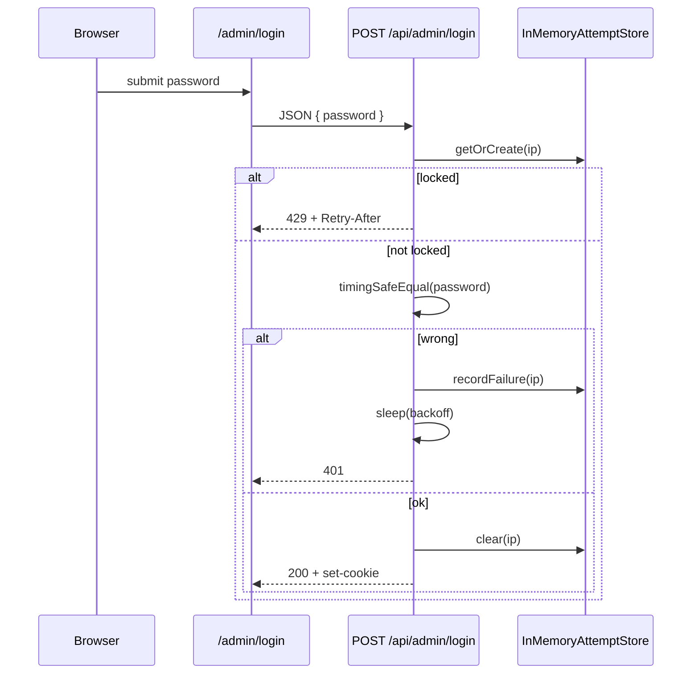

# Admin Login Brute-Force Protection

**Date:** 2026-08-06  
**Status:** Approved  
**Repos:** `apps/ai-web` (`POST /api/admin/login`, login UI)  
**Approach:** In-memory per-IP rate limit + progressive server-side delay + hard lockout

## Goal

Закрыть бесконечный перебор пароля на `/admin/login`: после нескольких неудач замедлять ответы и временно блокировать IP.

## Non-goals

- CAPTCHA / Turnstile / hCaptcha
- Redis или общее хранилище между инстансами
- Смена модели auth (SSO, 2FA, multi-admin)
- Rate limit на других admin API (только login)
- Клиентская «защита» без серверной проверки

## Decisions

| Вопрос | Решение |
|--------|---------|
| Стратегия | Лимит попыток + нарастающая задержка |
| Хранение | In-memory `Map` в процессе Next.js |
| Ключ | Client IP (`x-forwarded-for` first hop / `x-real-ip` / `unknown`) |
| Пороги | Жёсткие: delay с 2-й, lockout с 5-й на 30 мин |
| Где enforce | Только сервер: `apps/ai-web/src/app/api/admin/login/route.ts` |
| Успех | Сброс записи для IP |

## Thresholds

| Consecutive failures | Behavior |
|----------------------|----------|
| 1 | Immediate `401` |
| 2 | Server sleep ~1s, then `401` |
| 3 | Server sleep ~2s, then `401` |
| 4 | Server sleep ~5s, then `401` |
| 5+ | Lockout 30 minutes → `429` with human-readable Russian message; include `Retry-After` (seconds) |

Notes:

- Failure count increments **before** delay/lockout decision for that attempt.
- While locked, further attempts do **not** extend lockout (fixed window from first lock).
- Successful password check clears the IP entry entirely.
- Process restart clears all counters (accepted trade-off for in-memory).

## Architecture

### Components

1. **`adminLoginAttempts.ts`** (new, under `apps/ai-web/src/lib/`)
   - `getClientIp(request: Request): string`
   - `checkLoginAllowed(ip): { allowed: true } | { allowed: false; retryAfterSec: number }`
   - `recordLoginFailure(ip): { delayMs: number }` — updates fails / may set `lockedUntil`
   - `clearLoginFailures(ip): void`
   - Periodic opportunistic prune of expired entries on access
   - Pure constants for delays and lockout duration (exported for tests)

2. **`POST /api/admin/login`**
   - Resolve IP → if locked, return `429` immediately (no password work needed beyond existing env checks; may still short-circuit before compare)
   - On bad password: `recordLoginFailure` → `await sleep(delayMs)` → `401` «Неверный пароль»
   - On good password: `clearLoginFailures` → existing session cookie flow
   - On lockout response body: `{ error: 'Слишком много попыток. Повторите через N мин' }` (+ optional `retryAfterSec`)

3. **Login UI** (`apps/ai-web/src/app/admin/login/page.tsx`)
   - Surface `error` from `401` / `429` via existing `messageApi.error`
   - No client-side attempt counter required

## Error handling

| Case | Status | User message |
|------|--------|--------------|
| Wrong password | 401 | Неверный пароль |
| Locked out | 429 | Слишком много попыток. Повторите через N мин |
| Missing `ADMIN_PASSWORD` | 500 | unchanged |
| Session misconfig | 500 | unchanged |

Do not reveal whether lockout vs wrong password differs in timing beyond the intentional backoff (lockout is immediate 429 without long sleep).

## Testing

- Unit tests for store: delay schedule, lockout at 5, clear on success, lockout not extended, prune after expiry.
- Route tests (if present pattern): 401 then progressive behavior; 429 after 5 fails; success clears and allows immediate retry.

## Out of scope / accepted risks

- Multi-instance deploy: each instance has its own counters (attacker may get N× attempts across instances).
- Shared NAT: one bad actor can lock a shared egress IP for 30 minutes.
- IP spoofing without trusted proxy headers: rely on reverse proxy to set/overwrite `x-forwarded-for`.
