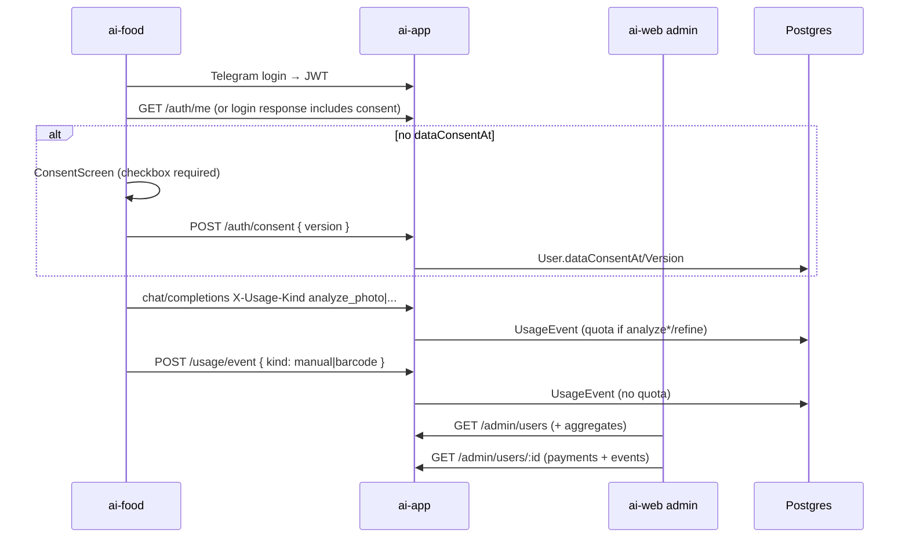

# Admin Users Page + Data Consent + Typed Usage

**Date:** 2026-08-06  
**Status:** Approved  
**Repos:** `apps/ai-web` (admin UI + privacy copy), `apps/ai-app` (Prisma, auth consent, usage kinds, admin API), `apps/ai-food` (consent gate, typed usage headers, manual/barcode events)  
**Approach:** Extend `UsageEvent.kind` with typed analyze/manual/barcode; store consent on `User`; admin `/admin/users` list + detail; consent screen after first Telegram login in ai-food only.

## Goal

1. Страница **Пользователи** в админке: кто сколько генерил (фото / описание / фото+описание / refine / вручную / штрихкод) + карточка с платежами и активностью.  
2. Галочка согласия на сбор данных при **первом входе в аккаунт** (Telegram login) в ai-food.  
3. Обновить политику конфиденциальности (и при необходимости terms) — явно перечислить собираемые данные.

## Non-goals

- Синхронизация локального профиля КБЖУ / приёмов пищи на сервер  
- Повторное согласие при смене текста в этой итерации (только первый вход; version храним для будущего)  
- Consent для анонимных device-only пользователей  
- Backfill / эвристика типов для старых `analyze` / `refine`  
- Фильтры/экспорт CSV / bulk-actions в админке  
- Soft-delete пользователей

## Decisions

| Вопрос | Решение |
|--------|---------|
| Где consent UI | Только ai-food после первого Telegram-логина |
| Админ-страница | Список + детальная карточка (платежи, события) |
| История kind | Только вперёд; legacy `analyze`/`refine` без разбиения |
| Хранение аналитики | Расширить `UsageEvent.kind` (не отдельная таблица, не счётчики на User) |
| Квота AI | Списывается для kind, начинающихся с `analyze`, и для `refine` |
| manual / barcode | UsageEvent без списания квоты |
| Версия согласия | Константа `DATA_CONSENT_VERSION = '2026-08-06'` |

## Data model (`apps/ai-app` Prisma)

### User — новые поля

```prisma
dataConsentAt      DateTime?
dataConsentVersion String?
```

- `null` consent → пользователь залогинен, но ai-food блокирует продукт до `POST /auth/consent`.  
- После согласия: `dataConsentAt = now()`, `dataConsentVersion = DATA_CONSENT_VERSION`.

### UsageEvent.kind (строки)

| kind | Источник | Квота AI |
|------|----------|----------|
| `analyze_photo` | только фото | да |
| `analyze_text` | только описание | да |
| `analyze_photo_text` | фото + описание | да |
| `refine` | уточнение блюда | да |
| `manual` | ручной ввод | нет |
| `barcode` | штрихкод | нет |
| `analyze` | legacy (до релиза) | да |

Миграция: только новые колонки на `User`; существующие `UsageEvent` не меняем.

## Architecture



## Gateway (`apps/ai-app`)

### Auth

- Ответ login и `GET /auth/me` (если endpoint есть; иначе добавить лёгкий `GET /auth/me`): поля `dataConsentAt`, `dataConsentVersion`.  
- `POST /auth/consent` (JWT required):  
  - body: `{ version: string }` — только если `version === DATA_CONSENT_VERSION`, иначе 400.  
  - идемпотентно: если уже есть consent — 200 с текущими полями.  
  - пишет `dataConsentAt`, `dataConsentVersion`.

### Quota (`lib/quota.ts`, middleware)

- Учитывать в лимите все kind, где `kind === 'refine' || kind.startsWith('analyze')`.  
- `finalizeQuotaUsage` пишет в UsageEvent фактический kind из заголовка (после валидации whitelist).  
- Whitelist для chat: `analyze`, `analyze_photo`, `analyze_text`, `analyze_photo_text`, `refine`. Default при отсутствии/невалидном заголовке: `analyze` (совместимость со старыми клиентами). Новый ai-food всегда шлёт typed kind.

### Non-quota events

- `POST /usage/event` (device id + optional user token):  
  - body `{ kind: 'manual' | 'barcode' }`  
  - создаёт UsageEvent, привязывает user если токен есть  
  - не трогает remaining quota  
  - 401/403 по тем же правилам device, что usage endpoints

### Admin API

**`GET /admin/users?q=`** (расширить существующий):

- Поля user + `dataConsentAt`, `dataConsentVersion`  
- `usageCounts`: объект `{ analyze_photo, analyze_text, analyze_photo_text, refine, manual, barcode, analyze }` (числа; отсутствующие kind = 0)  
- Реализация: Prisma `groupBy` UsageEvent по `userId`+`kind` для найденных users

**`GET /admin/users/:id`** (новый):

```json
{
  "user": { "...profile", "dataConsentAt", "dataConsentVersion", "subscription..." },
  "usageCounts": { "...": 0 },
  "payments": [ /* как admin payments, take 50 */ ],
  "recentEvents": [
    { "id", "kind", "deviceId", "createdAt" }
  ]
}
```

- `recentEvents`: orderBy createdAt desc, take 100 (query `?eventsLimit=` optional, max 200)  
- 404 если user не найден

### Admin stats (обзор)

- Обновить агрегаты analyze за 7/30 дней: считать `kind startsWith 'analyze'` (включая legacy + typed), refine отдельно. Не блокирует релиз users-page, но желательно в том же PR чтобы обзор не «терял» новые kinds.

## Admin UI (`apps/ai-web`)

### Nav

- `AdminShell`: пункт **Пользователи** → `/admin/users`

### `/admin/users`

- PageHeader: «Пользователи» / «Аккаунты, согласие и статистика генераций»  
- Search input + Table (TanStack Query → BFF `/api/admin/gateway/users`)  
- Columns: user (avatar/name), username, telegramId, subscription, consent (да/нет + date), createdAt, counters (короткие заголовки: Фото, Текст, Ф+Т, Refine, Ручн., ШК, Legacy)  
- Row click → `/admin/users/[id]`

### `/admin/users/[id]`

- Карточка профиля + subscription + consent  
- Statistic/grid счётчиков  
- Table платежей  
- Table recent events  
- Кнопка «Назад к списку»

### BFF

- Существующий proxy users; добавить `users/[id]/route.ts` → gateway `GET /admin/users/:id`

Стиль: как Цены/Платежи — Ant Design, тёмная тема.

## ai-food

### Consent gate

- После успешного auth, если `dataConsentAt == null` → маршрут/экран согласия (нельзя уйти в дневник).  
- UI: заголовок «Согласие на обработку данных»; чеклист собираемых данных; ссылка на privacy; checkbox «Согласен на обработку данных»; кнопка «Продолжить» disabled без checkbox.  
- Guard рядом с auth (не путать с ProfileGuard onboarding): залогинен без consent → отдельный маршрут `/consent` (полноэкранный экран, не модалка).

### Typed usage

- `useSaveMeal` / analyze API:  
  - image(s) only → `analyze_photo`  
  - description only → `analyze_text`  
  - both → `analyze_photo_text`  
- refine → `refine`  
- manual entry success → `POST /usage/event` `manual`  
- barcode save success → `POST /usage/event` `barcode`

### Auth client

- Хранить/обновлять consent fields в auth store после login и после POST consent.

## Legal copy (`apps/ai-web`)

Обновить `privacyContent.ts` (и коротко `termsContent.ts` при необходимости):

**Собираем:**

- Данные аккаунта Telegram: id, username, имя, фамилия, URL фото (если есть)  
- Идентификатор устройства (`deviceId`)  
- События использования: генерации по фото / по тексту / фото+текст, уточнения, ручной ввод, сканирование штрихкода (факт и время, без содержимого фото/текста в UsageEvent)  
- Платежи и статус подписки  
- Технические логи запросов к API (для квоты, безопасности, отладки)

**Не собираем на сервер в этой версии:** содержимое дневника, фото еды, локальный профиль КБЖУ/цели — они остаются на устройстве (уточнить в тексте, что анализ фото обрабатывается для ответа модели и не сохраняется как UsageEvent payload).

**Цель:** предоставление сервиса, учёт квоты, поддержка, улучшение продукта, биллинг.

**Согласие:** при первом входе в аккаунт; без согласия функциональность аккаунта недоступна.

Экран согласия в ai-food дублирует краткий список и ссылается на полную `/privacy`.

## Error handling

- Consent без JWT → 401  
- Неверная version → 400  
- `/usage/event` с недопустимым kind → 400  
- Admin user not found → 404  
- ai-food: ошибка POST consent → показать сообщение, остаться на экране

## Testing

- Prisma migration applies; User fields present  
- Quota: `analyze_photo` counts toward limit; `manual` does not  
- Consent: POST sets fields; second POST idempotent  
- Admin list returns counts; detail returns payments + events  
- ai-food: без consent redirect/block; с consent — проход  
- Privacy page mentions listed data categories

## Out of scope follow-ups

- Re-consent when `DATA_CONSENT_VERSION` changes  
- Device-level consent before login  
- Storing meal/profile server-side  
- Admin export / filters
