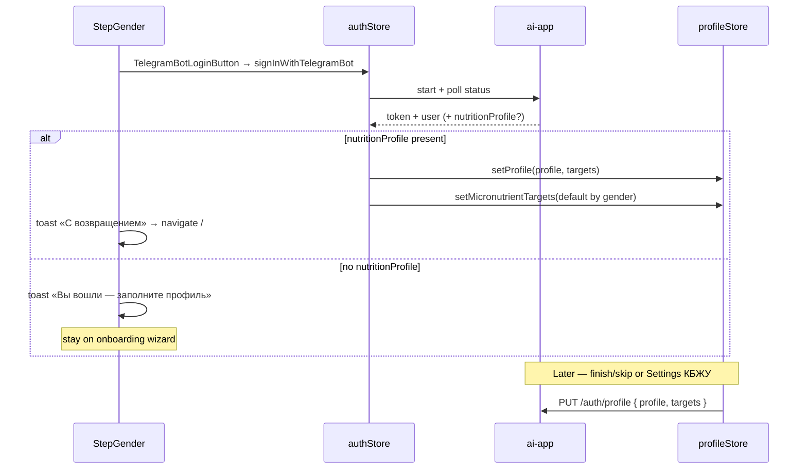

# Telegram login on onboarding + nutrition profile sync

**Date:** 2026-08-06  
**Status:** Approved (conversation) — awaiting spec file review  
**Repos:** `ai-food` (onboarding UX + client sync); `ai-app` (schema + profile API)  
**Approach:** JSON column `User.nutritionProfile` + `PUT /auth/profile`; Telegram bot login CTA on step «Ваш пол»; restore + skip onboarding when server profile exists

## Goal

On the first onboarding step («Ваш пол»):

1. User can **Войти через Telegram** (existing bot deep-link flow).
2. If the account already has a saved nutrition profile on the server → restore it locally and **skip onboarding** (go to app).
3. If the account is new / has no nutrition profile → show that the user is signed in and **continue onboarding**.
4. After onboarding completes (or КБЖУ change in Settings) → **persist profile + DailyTargets** to the gateway when authenticated.

## Non-goals

- Syncing micronutrient daily targets (`micronutrientTargets`) to the server
- Telegram Login Widget or Mini App auth (keep existing bot challenge)
- Editing gender/age/weight/goals inside Settings UI (still via redo onboarding)
- Syncing diary / meals / device-local history
- Making Telegram login mandatory for using the app
- Conflict resolution UI (last write wins; see Sync policy)

## Decisions (locked)

| Topic | Choice |
|-------|--------|
| «Был зареган ранее» | Server has non-null `nutritionProfile` (not merely existing `User` row) |
| Synced payload | `UserProfile` + `DailyTargets` only |
| Storage | Single JSON column on `User` |
| Settings trigger | `updateTargets` (Изменить КБЖУ); redo onboarding clears local then re-uploads on finish |
| Micronutrients after restore | Local defaults by gender (then optional existing AI refresh if already used on finish) — not from server |

## Architecture



Auth and onboarding remain separate stores. ProfileGuard still keys off local `profile !== null`. Skipping onboarding for returning users works by writing restored data into `useProfileStore` before navigation.

## Data model (`ai-app`)

```prisma
model User {
  // …existing fields…
  /// { profile: UserProfile, targets: DailyTargets } or null
  nutritionProfile Json?
}
```

### JSON shape (contract)

```ts
type NutritionProfilePayload = {
  profile: {
    gender: 'male' | 'female';
    age: number;
    height: number;
    weight: number;
    targetWeight: number;
    targetWeightDate: string; // YYYY-MM-DD
    activity: 'low' | 'medium' | 'high';
    goal: 'lose' | 'maintain' | 'gain';
    dietType: 'none' | 'halal' | 'vegan' | 'vegetarian';
  };
  targets: {
    kcal: number;
    protein: number;
    fat: number;
    carbs: number;
    fiber: number;
  };
};
```

Validation on `PUT`: required object with `profile` + `targets`; enums and positive numbers; reject unknown keys loosely or strip (prefer strip + validate known). Invalid body → `400`.

`null` column = no server profile → client must run onboarding.

## API (`ai-app`)

### Extend public user

`GET /auth/me` and Telegram status `user` object include:

```ts
nutritionProfile: NutritionProfilePayload | null
```

Same shape after successful `PUT`.

### `PUT /auth/profile`

- Auth: `X-User-Token` (existing JWT middleware)
- Body: `NutritionProfilePayload`
- Behavior: set `User.nutritionProfile`, return public user
- Errors: `401` missing/invalid token; `400` invalid payload

No dedicated `DELETE` in MVP. Clearing happens only if product later needs it; redo onboarding overwrites on next successful finish when logged in.

Demo login (`POST /auth/demo/login`) should also return `nutritionProfile` from the demo user row (same public mapper).

## Client (`ai-food`)

### UI — `StepGender`

- Keep gender cards + «Далее».
- Below primary CTA: divider or short hint + `TelegramBotLoginButton`.
- If already signed in (session present) and no local profile yet: show compact «Вы вошли как {name}» and hide the login button (or show disabled «Вы вошли»).

### Restore / skip helper

Shared helper e.g. `applyRemoteNutritionProfile(user)` / `completeLoginNavigation(user)`:

1. If `user.nutritionProfile` valid:
   - `setProfile(profile, targets)`
   - `setMicronutrientTargets(defaultMicronutrientTargets(profile.gender))`
   - navigate `/` (replace); toast «С возвращением» when coming from an explicit login action
2. Else:
   - if caller is onboarding: toast «Вы вошли — заполните профиль»; stay
   - if caller is `LoginPage`: navigate `/onboarding` (replace) so ProfileGuard is not a bounce

Call sites:

- After `signInWithTelegramBot` / demo login success
- **Cold start on `/onboarding`:** if `userToken` present and local `profile === null`, `GET /auth/me` once; if `nutritionProfile` → restore + leave onboarding without forcing another Telegram confirm

Micronutrient AI refresh after restore is optional (nice-to-have); MVP uses gender defaults only.

### Sync write paths

When `userToken` is set, call `PUT /auth/profile` after:

1. Onboarding `finish()` / `skip()` (after local `setProfile`)
2. Settings `handleSaveTargets` / `updateTargets`

Failure: keep local state; `toast.error` once. No blocking spinner required beyond the existing save UX.

Guest (no token): no PUT (current local-only behavior).

### Import backup / reset

- Import backup: if authenticated, PUT after applying imported profile+targets (same as local set).
- `resetProfile` + redo onboarding: local clear only; server profile remains until next finish overwrites (returning user on another device still gets old server profile — intentional last-write-wins).

## Sync policy

- **Source of truth while online + authenticated:** last successful `PUT` wins.
- No merge of partial fields; each PUT sends full `profile` + `targets`.
- Local persist remains Capacitator Preferences; server is recovery for re-login / new device.

## Error handling

| Case | Behavior |
|------|----------|
| Telegram login cancel/fail | Existing button error path |
| PUT fails | Toast; local profile kept |
| Corrupt/partial JSON on GET | Treat as `null` (log server-side); force onboarding |
| Logged in, no server profile, no local | Stay on / open onboarding |

## Testing

- Gateway: validate PUT accepts good payload; rejects bad enums; GET me returns null then stored object
- Client: StepGender renders Telegram CTA; onSuccess with profile → store filled + navigate; without → toast + stay
- Settings targets save triggers PUT when token present
- LoginPage restore path when server profile exists and local empty

## Docs

Update `apps/ai-food/docs/AI-GATEWAY.md` auth section with `nutritionProfile` and `PUT /auth/profile`.

## Implementation order

1. Prisma migration + public user mapper + `PUT /auth/profile`
2. Client API + sync helper hooked to finish/skip/settings
3. StepGender Telegram CTA + post-login restore/skip
4. LoginPage align with same helper
5. Docs + tests
