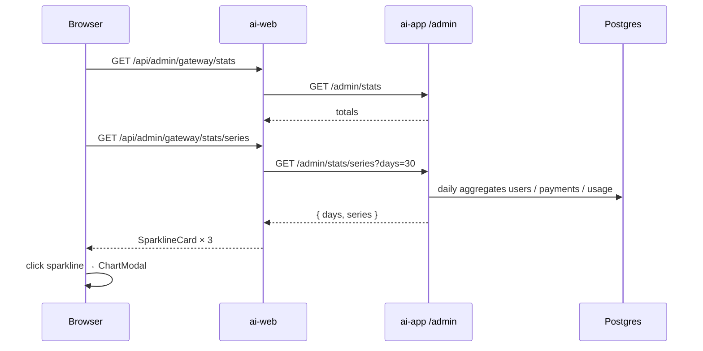

# Admin Overview Charts (sparkline → modal)

**Date:** 2026-08-07  
**Status:** Approved  
**Repos:** `apps/ai-web` (admin UI) + `apps/ai-app` (gateway admin API)  
**Approach:** Separate `GET /admin/stats/series` + `@ant-design/plots` mini charts with Modal detail

## Goal

На странице «Обзор» (`/admin`) показать динамику за **30 дней** в виде небольших графиков для:

1. **Пользователи** — новые регистрации и накопительный итог (две линии)
2. **Сумма платежей** — сумма за день и накопительный итог (две линии)
3. **Usage** — анализы и уточнения (две линии)

Клик по мини-графику открывает **Modal** с большим графиком (оси, тултип, легенда).

## Non-goals

- Графики на других admin-страницах
- Смена периода в UI (фиксируем 30 дней; API допускает `days` с clamp)
- Real-time / websocket обновления
- Экспорт CSV / PNG
- Сравнение периодов (WoW / MoM)
- Замена карточек-итогов «Всего пользователей», «Активные подписки», «Подтверждённые платежи», «Сумма платежей» — они остаются из `/admin/stats`

## Decisions

| Вопрос | Решение |
|--------|---------|
| Период | 30 дней, по дням (включая дни с нулями) |
| Users series | `new` + `total` на одном графике |
| Payments series | `sumKopecks` + `totalKopecks` на одном графике |
| Usage UI | Убрать 4 карточки 7/30 дней; один график analyze + refine |
| Библиотека | `@ant-design/plots` |
| Данные | Отдельный `GET /admin/stats/series` (не раздувать текущий `/stats`) |
| Детализация | Modal по клику на мини-график |
| Итоги | `/admin/stats` без изменений контракта |

## Architecture



### Gateway (`apps/ai-app`)

`GET /admin/stats/series?days=30` (behind `requireAdminKey`)

- Query: `days` optional, default `30`, clamp **7–90**
- Timezone: **UTC** calendar days (`YYYY-MM-DD`)
- Response:

```json
{
  "days": 30,
  "series": {
    "users": [
      { "date": "2026-07-09", "new": 0, "total": 3 }
    ],
    "payments": [
      { "date": "2026-07-09", "sumKopecks": 0, "totalKopecks": 1000 }
    ],
    "usage": [
      { "date": "2026-07-09", "analyze": 2, "refine": 0 }
    ]
  }
}
```

**Semantics**

| Series | Daily field | Cumulative field |
|--------|-------------|------------------|
| users | `new` — count of `User` with `createdAt` on that day | `total` — users with `createdAt <= end of that day` (absolute, includes before window) |
| payments | `sumKopecks` — sum of `Payment.amount` where `status = confirmed` and confirmed day = that day (use `paidAt` if set, else `createdAt`) | `totalKopecks` — running sum of confirmed amounts with day ≤ that day (absolute, includes before window) |
| usage | `analyze` — `UsageEvent` where `kind` starts with `analyze`; `refine` — `kind === 'refine'` | none (two independent daily series) |

Each array length = `days`. Missing days filled with `0` for daily fields; cumulative carries forward previous day.

Implementation note: prefer Prisma `groupBy` / filtered `findMany` + in-memory bucket by day if data volumes stay small (admin scale); raw SQL `date_trunc` only if needed for performance.

### BFF (`apps/ai-web`)

- New route: `GET /api/admin/gateway/stats/series` → `proxyGatewayAdmin('stats/series?days=30')` (or forward query string if present)
- Client: `adminApi('stats/series')` / `adminApi('stats/series?days=30')`

### Frontend (`apps/ai-web`)

**Deps:** add `@ant-design/plots` to `apps/ai-web`.

**Components** (under `apps/ai-web/src/components/`):

1. `SparklineCard` — Card with title, optional summary numbers, compact `Line` (~80–120px height), `cursor: pointer`, `role="button"`, opens modal on click/Enter
2. `ChartModal` — Ant Design `Modal` + full `Line` chart (legend, tooltip, axes); payments format kopecks → ₽

**Page layout (`app/admin/page.tsx`)**

- Section **Пользователи:** keep two Statistic cards; add `SparklineCard` users (lines: Новые / Всего)
- Section **Платежи:** keep two Statistic cards; add `SparklineCard` payments (lines: За день / Накопительно)
- Section **Usage:** remove four 7/30 Statistic cards; single `SparklineCard` with period totals (sum analyze / sum refine over 30 days) + two lines

**Queries:** two `useQuery` — `['admin','stats']` and `['admin','stats','series']`. Independent loading/error: series failure shows `Alert`, totals still render.

**Theme:** dark admin theme; default plot colors acceptable; no custom marketing palette.

## Error handling

| Case | Behavior |
|------|----------|
| Series 401/5xx / network | Alert «Не удалось загрузить графики»; три SparklineCard не рендерятся |
| Stats fails | Existing Alert for totals |
| Empty DB | 30 points of zeros; cumulative starts from 0 / pre-window base |
| Invalid `days` | Clamp to [7, 90] |

## Testing

- Gateway: unit/integration test for `/admin/stats/series` (seed users/payments/usage across days; assert array length, zeros, cumulative, analyze vs refine)
- `apps/ai-web`: type-check; manual smoke — open `/admin`, see 3 sparklines, click → Modal, Esc closes

## Out of scope follow-ups (not this PR)

- Period selector in UI
- Active subscriptions time series
- Drill-down to filtered users/payments lists from chart points
